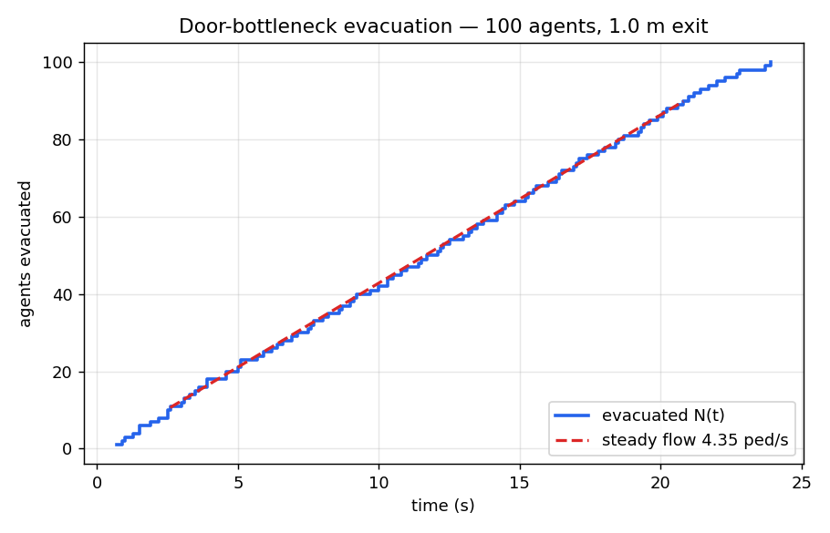

# Example: measure door-bottleneck flow via the bridge

This is the bridge's point in one script: **turn the browser viewer into a
measurable experiment.** It builds a 100-agent room with a single 1 m exit,
runs it through the viewer's own *Run Simulation* button over HTTP, pulls the
resulting SQLite trajectories back, and computes results you cannot read off the
GUI — the evacuation curve and the specific flow through the exit.



## Result (committed run, `jupedsim/jupedsim-web:latest`)

| quantity | value |
|---|---|
| agents | 100 |
| total evacuation time | 23.9 s |
| steady-state flow | 4.35 ped/s |
| specific flow | 4.35 ped/(s·m), door width 1.0 m |

The curve is straight over the congested phase → the 1 m door is the bottleneck
and passes a constant flow (a textbook result; contrast the same room at 20
agents, which is walk-time-limited at ~9.8 s and never saturates the door).

The flow is computed two independent ways that agree: agent-removal times, and a
full-height pedpy [`compute_n_t`](https://pedpy.readthedocs.io/) measurement line
just inside the throat (100/100 crossings counted).

> **On the number:** ~4.4 ped/(s·m) is *above* the experimental door range
> (~1.2–2.0). That is the app's **default, uncalibrated** CollisionFreeSpeedModel,
> not a bug in this script — and it is exactly the point. The bridge lets you
> *measure* the model so you can calibrate it against data, which clicking Run in
> the browser can't give you.

## Run it

Requires `pedpy` and `matplotlib`. Bring the stack up
([`../../nobuild`](../../nobuild/README.md)) and **freshly reload** the viewer
tab at <http://localhost:8081/draw>, then:

```bash
python bottleneck_flow.py --run            # drive a fresh sim, then analyse
python bottleneck_flow.py --sqlite FILE    # re-analyse an existing SQLite
python bottleneck_flow.py --run --agents 60
```

`--run` regenerates `bottleneck_evacuation.png` and `bottleneck_flow.csv`.

## Known constraint (one run per fresh viewer)

The bridge reliably drives **one** simulation per freshly loaded viewer session.
It does **not** support rapid re-parametrisation within a session: clearing the
scene between runs is unreliable (the clear-scene command can hang at *accepted*,
and `/api/results/latest` then returns the previous run's archive). So a
multi-point parameter sweep in a single session is not currently dependable —
reload the tab before each `--run`. This is a limitation of the current
viewer-automation path, not of the analysis.
